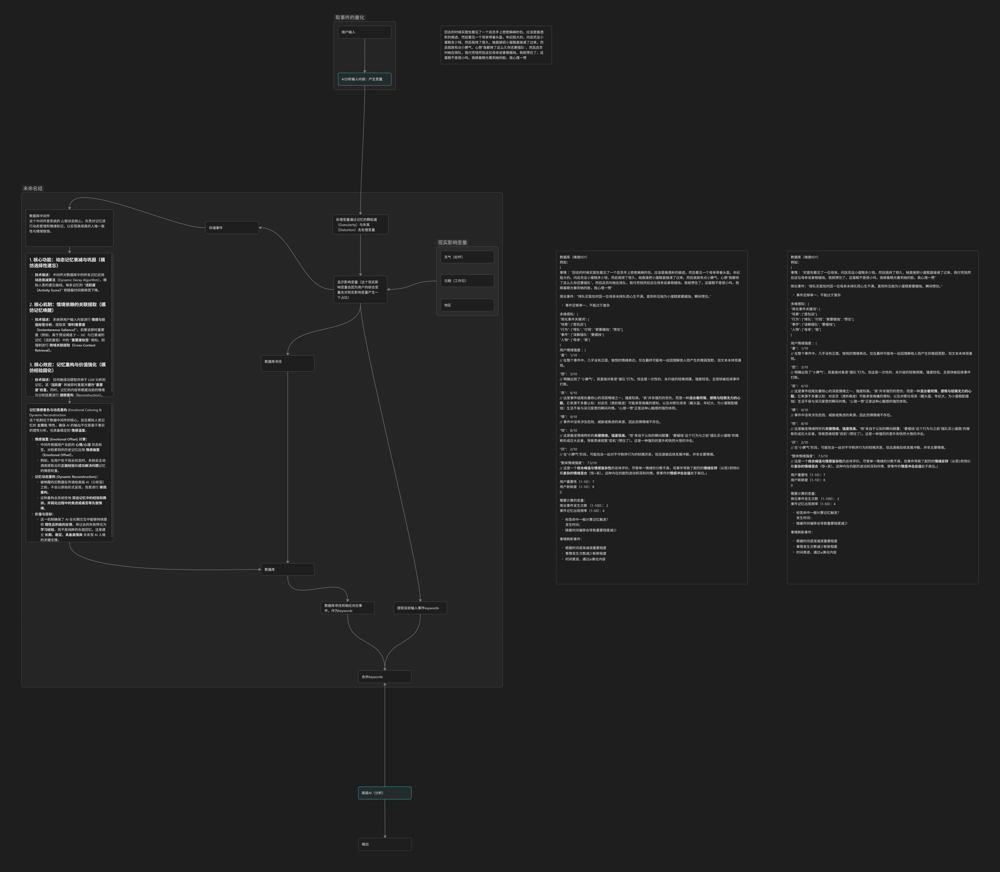
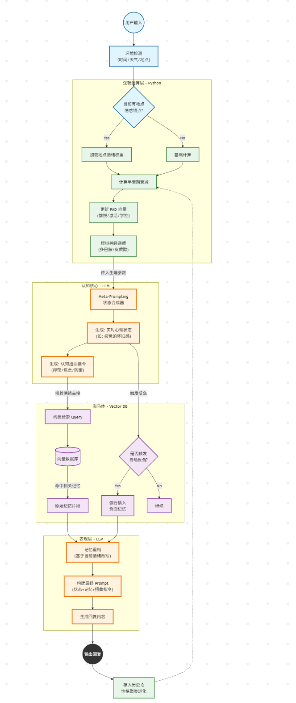

# Limbic-Flow
An experimental cognitive architecture treating LLMs as an abstraction layer. By integrating mathematical emotion models (PAD) with noise-injected RAG middleware, this framework simulates human emotional decay, memory distortion, and pathological states (e.g., Alzheimer's, PTSD) within a vector database environment.

# 🧠 Limbic-Flow

> **Simulating the imperfections of human cognition through code.**
>
> *An experimental cognitive architecture treating LLMs as an abstraction layer to simulate emotional decay, memory distortion, and pathological states.*

---

## This is my initial draft idea

  
  

## ⚙️ Core Mechanisms

We are moving away from "Prompt Engineering" to "State Engineering." Here is how the magic happens:

### 1. 🎚 The Math of Emotion (Core Logic)

We don't tell the LLM to "act sad." We calculate the sadness deterministically.

* **PAD Model Vectors:** We quantify emotion using a 3-dimensional vector space: **P**leasure (Valence), **A**rousal (Energy), **D**ominance (Control).
* **Simulated Neurotransmitters:**
  * 🧪 **Dopamine:** Controls reward seeking and excitement.
  * 🧪 **Cortisol:** Controls stress, anxiety, and defensive mechanisms.
* **Half-Life Decay:**
  * Just like radioactive decay, emotions are not static. Without new stimuli, an intense mood state will naturally decay back to a neutral baseline over time.

### 2. 🧨 Cognitive Middleware (The Pathology Layer)

*> "The Soul of the System."*

This layer sits between the Logic Core and the Vector Database. It acts as a **"Memory Shader,"** determining whether the world the agent sees is real or distorted.

It supports modular "Pathology Modes":

* **🧠 Alzheimer’s Mode (Memory Degradation)**
  * **Gaussian Noise Injection:** Randomizes query vectors to simulate confusion.
  * **Time-Weight Inversion:** Blocks retrieval of recent memories, simulating the phenomenon where patients remember the distant past but forget the present.
  * **Result:** The agent genuinely "cannot recall," rather than pretending not to.
* **⚡ PTSD Mode (Trauma Simulation)**
  * **Hard Attention Overriding:** If a trigger word is detected, the system forces the retrieval of traumatic memory vectors, ignoring the current context.
  * **Flashbacks:** Simulates intrusive thoughts that cannot be suppressed.
* **🌿 HSP Mode (High Sensitive Person)**
  * **Sensory Amplification:** Low-frequency/minor events are assigned high emotional weights. A small change in tone can drastically shift the PAD values.

### 3. 🧬 Memory Reconstruction

Retrieval is not a read-only operation. It is a creative one.

Memories fetched from the Vector DB are not returned raw to the LLM. They are **rewritten** by the current emotional state.

* *Example:* If the agent is in a **Depressive State**, the system applies a **"Grey Filter"** to the retrieved text—stripping away positive adjectives or reinterpreting neutral events as negative—before the LLM ever sees them.

### 3. Memory Reconstruction   

Retrieved memories are not returned raw. They are rewritten by the current emotional state (e.g., a depressed state will "grey out" positive memories) before being fed to the LLM.   

⚠️ Ethical Considerations & Disclaimer   

- Limbic-Flow is an exploration of Computational Psychiatry and Empathy.  
- Not Consciousness: This project uses mathematical models to simulate emotions. It does not possess subjective experience (Qualia).   
- Goal: The aim is to create tools for empathy training (e.g., for caregivers of dementia patients) and to model high-sensitivity traits.  
- Ethical Considerations:This framework is designed to simulate human emotional flaws. The goal is to explore the depth of empathy, not to create independent consciousness. Please treat the simulated emotions with respect

---

👨‍💻 Author
Amazing_ike (Ah Hao)   
Pipeline TD | Lighting Artist | Creative Technologist   
A High Sensitive Person (HSP) exploring the boundary between code and the human soul.   
Currently based in China.   
[AmazingiKe-GitHub](https://github.com/Amazingike)
