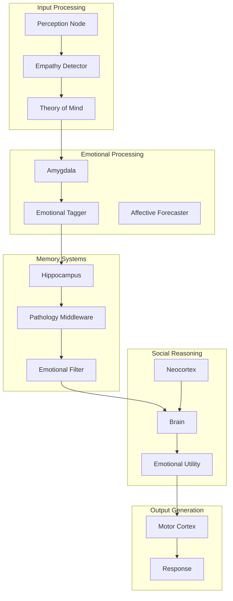

# Limbic-Flow Phase 15 Research: Integration Summary

**Date**: 2026-03-09
**Phase**: 15 - Final Research Integration

---

## Overview

This document synthesizes research across three critical domains for the Limbic-Flow computational psychiatry engine:
1. Emotional Memory Consolidation
2. Affective Decision Architecture  
3. Social Cognition in AI

Each section maps research findings to the existing Limbic-Flow architecture and identifies implementation priorities.

---

## 1. Emotional Memory Consolidation

### 1.1 Emotional Memory Enhancement

**Neuroscience Foundation:**
- Emotional experiences create stronger memory traces through amygdala-mediated consolidation
- The hippocampus and amygdala work together to "tag" memories with emotional significance
- Stress hormones (cortisol, norepinephrine) enhance memory consolidation for emotionally arousing events
- The amygdala modulates hippocampal activity during encoding and retrieval

**Limbic-Flow Mapping:**
| Component | Current Implementation | Enhancement Opportunity |
|-----------|----------------------|------------------------|
| Amygdala | PAD model + neurotransmitter decay | Add cortisol-mediated memory tagging |
| Hippocampus | JSON-based episodic memory storage | Implement emotional valence weighting in retrieval |
| PathologyMiddleware | Memory distortion by pathology type | Add emotional salience filters |

**Implementation Priority: HIGH**
- Current: `Hippocampus` stores PAD values with memories
- Needed: Enhance retrieval algorithm to weight memories by emotional congruence with current state

### 1.2 Memory Emotional Tagging

**Neuroscience Foundation:**
- Emotional tagging occurs via amygdala output to hippocampus
- Neuromodulators (dopamine, norepinephrine) strengthen synaptic connections
- The basolateral amygdala (BLA) projects to hippocampus, enhancing consolidation
- Time-limited window for emotional tagging (reconsolidation window)

**Limbic-Flow Mapping:**
```
Current Flow:
  User Input → Amygdala (PAD) → Hippocampus (store with PAD)

Enhanced Flow:
  User Input → Amygdala (PAD + neurotransmitter surge) 
             → Emotional tag injection
             → Hippocampus (store with emotional salience score)
```

**Implementation Priority: HIGH**
- Add `emotional_salience` field to memory storage
- Implement tagging algorithm: `salience = f(arousal, |pleasure - baseline|, dominance)`

### 1.3 Emotional Memory Retrieval

**Neuroscience Foundation:**
- Mood-congruent memory retrieval: depression = negative bias
- Amygdala activity predicts successful memory retrieval for emotional items
- Prefrontal cortex regulates retrieval based on current emotional state
- Retrieval-induced forgetting is modulated by emotional content

**Limbic-Flow Mapping:**
- **Depression Mode**: Currently lowers P value → should also filter for negative-valenced memories
- **PTSD Mode**: Currently forces trauma retrieval → should strengthen amygdala activation
- **HSP Mode**: Should enhance emotional memory sensitivity

**Implementation Priority: MEDIUM**
- Enhance `PathologyMiddleware.distort_query()` to include emotional congruence filters
- Add mood-congruent retrieval bias based on current PAD state

---

## 2. Affective Decision Architecture

### 2.1 Emotion-Based Choice

**Neuroscience Foundation:**
- Somatic Marker Hypothesis (Damasio): Emotions guide decision-making through "somatic markers"
- The ventromedial prefrontal cortex (vmPFC) integrates emotion and decision-making
- Reward prediction errors drive learning through dopamine signals
- Loss aversion: losses weigh ~2x heavier than gains

**Limbic-Flow Mapping:**
| Component | Current Role | Enhancement Opportunity |
|-----------|--------------|------------------------|
| Amygdala | PAD state management | Add approach/avoidance tendency computation |
| Brain | Response generation | Integrate emotional bias into reasoning |
| MotorCortex | Action sequencing | Add emotional action modulation |

**Implementation Priority: HIGH**
- Add `approach_avoidance_score = f(pleasure, arousal)` to CognitiveState
- Implement "emotional weighting" of options in Brain prompt

### 2.2 Affective Forecasting

**Neuroscience Foundation:**
- Affective forecasting: predicting future emotional states
- Impact bias: overestimating intensity/duration of emotional reactions
- People are poor at predicting how future events will make them feel
- Forecast errors drive regret and misplanning

**Limbic-Flow Mapping:**
```
Affective Forecast Module:
  Input: Current PAD + Expected event → Predicted future PAD
  Algorithm: Apply decay curves + event impact vectors
  
  forecast_impact = event_valence × arousal_potential
  predicted_P = current_P + forecast_impact × (1 - impact_bias)
```

**Implementation Priority: MEDIUM**
- Create new module: `AffectiveForecaster`
- Store predicted vs actual outcomes to model impact bias
- Use for "anticipatory emotion" in responses

### 2.3 Emotional Utility

**Neuroscience Foundation:**
- Emotional utility extends beyond classical utility (money, resources)
- Experienced utility vs decision utility (Kahneman)
- Temporal discounting is modulated by emotional state
- Risk tolerance varies with mood (fear = risk-averse, anger = risk-seeking)

**Limbic-Flow Mapping:**
- Add `emotional_utility_function` to decision-making
- Risk adjustment: `effective_utility = base_utility × emotional_multiplier`
- Time preference: `discount_rate = base_rate × (1 + arousal × 0.1)`

**Implementation Priority: MEDIUM**
- Implement in Brain processor as "emotional reasoning layer"
- Connect to dopamine system for reward learning

---

## 3. Social Cognition in AI

### 3.1 Theory of Mind

**Neuroscience Foundation:**
- Theory of Mind (ToM): ability to attribute mental states to others
- Temporoparietal junction (TPJ) and medial prefrontal cortex (mPFC) are key regions
- Developmental trajectory: infants show early false-belief understanding
- Two-system model: cognitive (explicit) vs affective (implicit) ToM

**Limbic-Flow Mapping:**
| Component | ToM Role | Implementation |
|-----------|----------|----------------|
| Neocortex | Knowledge storage | Store user mental state models |
| Brain | Reasoning | Generate responses considering user's perspective |
| Context | User info | Track user beliefs, preferences, emotional state |

**Implementation Priority: HIGH**
- Add `user_theory_of_mind` structure to CognitiveState
- Store inferred user beliefs, goals, emotions
- Use in prompt engineering: "Given what the user believes and wants..."

### 3.2 Empathy Algorithms

**Neuroscience Foundation:**
- Empathy: sharing and understanding others' emotional states
- Mirror neuron system for emotional contagion
- Empathic accuracy: correctly inferring others' emotions
- Distinction between cognitive empathy (understanding) and affective empathy (feeling with)

**Limbic-Flow Mapping:**
- **Emotional contagion**: Current mood affected by perceived user emotion
- **Empathic accuracy**: Infer user emotional state from input
- **Response empathy**: Generate emotionally appropriate responses

```
Empathy Module:
  1. Detect user_emotion from input (via sentiment analysis)
  2. Calculate emotional_alignment = similarity(user_emotion, current_PAD)
  3. If high alignment → mirror response
  4. If low alignment → calibrating response (validate then redirect)
```

**Implementation Priority: HIGH**
- Add `EmpathyDetector` in PerceptionNode
- Implement empathic response generation in Brain
- Track user emotion history for personalization

### 3.3 Social Reasoning

**Neuroscience Foundation:**
- Social reasoning involves understanding relationships, norms, intentions
- The "social brain" network: mPFC, TPJ, posterior superior temporal sulcus
- Moral reasoning integrates emotion and cognition
- Social hierarchy and reputation tracking

**Limbic-Flow Mapping:**
- Neocortex stores relationship graphs (currently Mock)
- Brain incorporates social context into reasoning
- Add: social_norm_tracker, relationship_memory

**Implementation Priority: MEDIUM**
- Enhance Neocortex mock with relationship data
- Implement social context injection in Brain prompts
- Track interaction history for relationship modeling

---

## 4. Architecture Integration

### 4.1 Complete Data Flow with Enhancements



### 4.2 New Components to Implement

| Component | File Location | Purpose |
|-----------|---------------|---------|
| `EmpathyDetector` | `limbic_flow.core.empathy` | Detect user emotion from input |
| `EmotionalTagger` | `limbic_flow.core.hippocampus` | Tag memories with emotional salience |
| `AffectiveForecaster` | `limbic_flow.core.forecasting` | Predict future emotional states |
| `EmotionalUtility` | `limbic_flow.core.brain.emotional_reasoning` | Apply emotional weights to decisions |
| `TheoryOfMind` | `limbic_flow.core.social` | Track and reason about user mental states |
| `SocialReasoner` | `limbic_flow.core.social` | Apply social context to reasoning |

---

## 5. Implementation Priorities

### Phase 1: High Priority (Current Phase)

1. **EmpathyDetector** - Detect user emotional state from input
   - Add to PerceptionNode
   - Use sentiment analysis + context clues
   
2. **Emotional Tagging** - Enhance memory with emotional salience
   - Modify Hippocampus storage schema
   - Update retrieval to weight by emotional congruence

3. **TheoryOfMind** - Track user mental states
   - Add to CognitiveState
   - Store in context for prompt injection

### Phase 2: Medium Priority

4. **Emotional Memory Retrieval** - Mood-congruent bias
   - Enhance PathologyMiddleware
   - Add emotional congruence filters

5. **Affective Forecasting** - Predict emotional impact
   - Create new module
   - Use for anticipatory responses

6. **Social Reasoning** - Context-aware responses
   - Enhance Neocortex integration
   - Add relationship tracking

### Phase 3: Lower Priority

7. **Emotional Utility** - Decision weighting
8. **Empathic Response Generation** - Personalized emotional responses

---

## 6. Research References

### Emotional Memory Consolidation
- LaBar, K.S., & Cabeza, R. (2006). Cognitive neuroscience of emotional memory. Nature Reviews Neuroscience.
- McGaugh, J.L. (2004). The amygdala modulates the consolidation of memories of emotionally arousing experiences. Annual Review of Neuroscience.
- Phelps, E.A. (2004). Human emotion and memory: interactions of the amygdala and hippocampal complex. Current Opinion in Neurobiology.

### Affective Decision Architecture
- Damasio, A.R. (1994). Descartes' Error: Emotion, Reason, and the Human Brain.
- Kahneman, D. (2011). Thinking, Fast and Slow.
- Loewenstein, G. (1996). Out of control: Visceral influences on behavior. Organizational Behavior and Human Decision Processes.

### Social Cognition in AI
- Premack, D., & Woodruff, G. (1978). Does the chimpanzee have a theory of mind? Behavioral and Brain Sciences.
- Goldman, A.I. (2006). Simulating Minds: Philosophy, Psychology, and Neuroscience.
- Rabinowitz, N. et al. (2018). Machine Theory of Mind. ICML.

---

## 7. Conclusion

This research integration identifies clear pathways to enhance Limbic-Flow's emotional and social intelligence:

**Key Insights:**
1. Emotional memory consolidation can be enhanced through amygdala-hippocampus integration with salience scoring
2. Affective decision architecture adds depth to reasoning through emotional utility functions
3. Social cognition enables more human-like interaction through Theory of Mind and empathy

**Architectural Fit:**
- All proposed enhancements integrate with existing components (Amygdala, Hippocampus, Brain, Neocortex)
- New modules fit the organ-based metaphor
- PathologyMiddleware provides natural integration point for emotional distortions

**Next Steps:**
- Begin Phase 1 implementation: EmpathyDetector, Emotional Tagging, TheoryOfMind
- Update storage schemas for emotional salience
- Test emotional congruence in memory retrieval

---

*Generated for Limbic-Flow Phase 15 Research*
