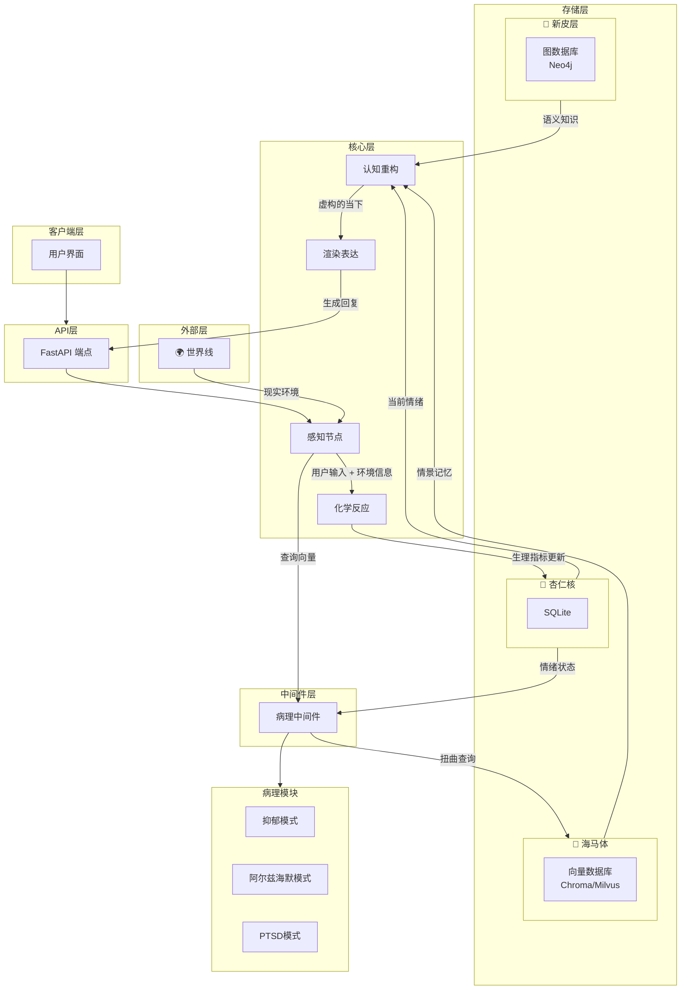

# Limbic-Flow 架构

## 概述

Limbic-Flow 是一个计算精神病学引擎，旨在模拟人类认知的不完美性。它创建了一个"不可靠叙述者"，具有有限的精力、扭曲的记忆和病理特征。

## 架构图

## 架构组件

### 1. 客户端层

- **用户界面**：与 Limbic-Flow 系统交互的任何前端应用程序。

### 2. API 层

- **FastAPI 端点**：用于客户端交互的 RESTful API 端点。

### 3. 核心层

- **感知节点**：处理用户输入和环境信息，使用 LLM 提取语义，并计算初始 PAD 冲击值。
- **化学反应**：基于初始冲击和当前杏仁核状态，使用半衰期衰减更新神经递质水平（多巴胺/皮质醇）。
- **认知重构**：通过结合扭曲的记忆片段和当前病理情绪，创建"虚构的当下"。
- **渲染表达**：使用重型 LLM 作为渲染器，根据当前情绪状态和记忆生成回复。

### 4. 中间件层

- **病理中间件**：充当"记忆着色器"，决定智能体看到的世界是真实的还是扭曲的。
  - **抑郁模式**：降低 P 值，屏蔽快乐记忆。
  - **阿尔兹海默模式**：注入高斯噪声，阻断近期记忆。
  - **PTSD 模式**：强制检索创伤记忆向量。

### 5. 存储层

- **🦄 海马体**：向量数据库（Chroma/Milvus），存储情景记忆、事件向量、主观感受（PAD）和时间戳。
- **🌰 杏仁核**：SQLite 数据库，存储状态日志和生理指标曲线（PAD、多巴胺、皮质醇）。
- **🧠 新皮层**：图数据库（Neo4j），存储语义知识、常识、事实和人际关系图谱。

### 6. 外部层

- **🌍 世界线**：提供现实环境信息的外部 API，如天气、新闻和日期。

## 数据流

1. 用户输入通过 API 层接收。
2. 感知节点处理输入并从世界线检索环境上下文。
3. 化学反应根据输入和当前状态更新神经递质水平。
4. 病理中间件根据当前病理状态扭曲记忆查询。
5. 扭曲的查询从海马体检索记忆。
6. 认知重构层将这些记忆与语义知识和当前情绪结合。
7. 表达层使用 LLM 渲染器生成回复。
8. 回复通过 API 层返回给客户端。
